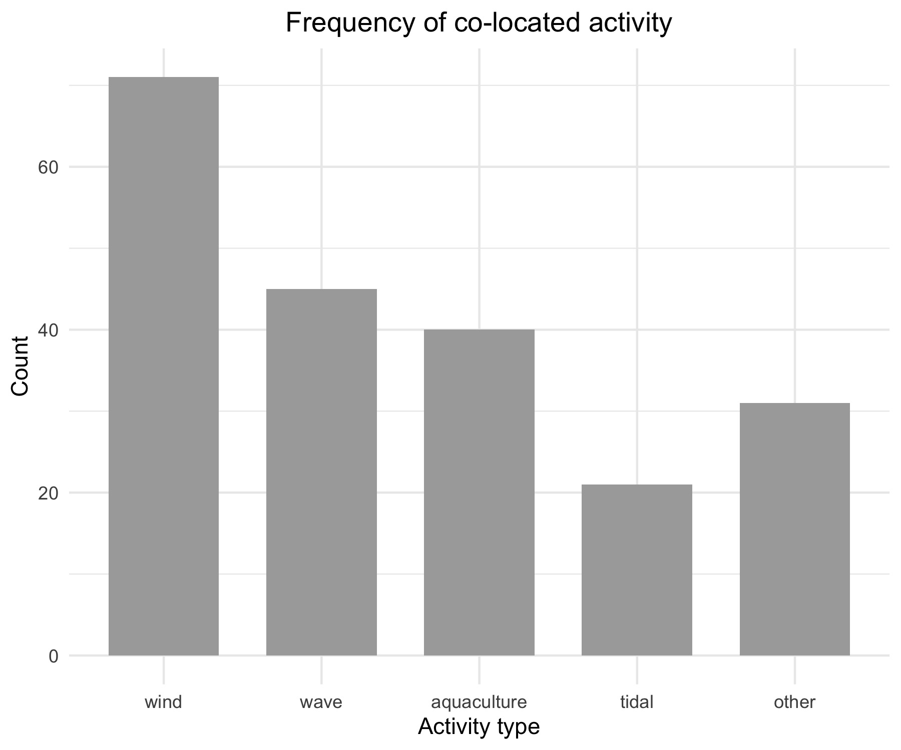

I was atttempting to create a (what I thought was going to be) simple bar plot of the co-location activity types on the x axis and the frequency of those uses on the y axis. But I want it to go in descending order expect for "other" which I think should be last. I have tried SO many different formatting types but no matter what I do, the ggplot spits out this stupid graph that is in the wrong order. 

Literally every time this is what it shows me. If you can figure out how to reorder this to the following order (on the x axis), I will buy you so much skittle beer and mac you wont know what to do with it all: "wind", "wave", "aquaculture", "tidal", "other".

I APPRECIATE YOU TO NO END <3

```{r setup, include=FALSE}
knitr::opts_chunk$set(echo = TRUE)

#attach packages

library(tidyverse)
library(here)
library(lubridate)
library(plotly)
```


```{r}
# I had to clean data to put it in tidy format

types <- read_csv(here("data", "data_types_tidy.csv"))
```


```{r}
# wrangling to group by types of co-location

types_tidy <- types %>% 
  select(first_author, year, title, activity_present) %>% 
  mutate(activity_present = as.factor(activity_present)) %>% 
  group_by(activity_present) %>% 
  summarize(act_count = n()) %>% 
  arrange(-act_count) %>% 
  na.omit()


```

## Data wrangling
```{r}
# trying creating a new data frame for the values so maybe the ggplot will be happier

colnames_v1 <- c("wind", "wave", "aquaculture", "tidal", "other")

types_counts <- c(types_tidy$act_count[1],
                  types_tidy$act_count[2],
                  types_tidy$act_count[3],
                  types_tidy$act_count[5],
                  types_tidy$act_count[4])


types_tidy_new <- data.frame(colnames_v1, types_counts)
```

## Plotting
```{r}
# types of co-location
### this needs to be fixed so that the data are in descending order. Not sure whats wrong

g2 <- ggplot(data = types_tidy_new, aes(x = as.factor(colnames_v1), y = types_counts)) +
  geom_bar(stat='identity', fill = "darkgray", width = 0.7) +
  labs(x = "Activity type",
       y = "Count",
         title = "Frequency of co-located activity") +
  theme_minimal() +
  theme(plot.title = element_text(hjust = 0.5))

ggplotly(g2)
```